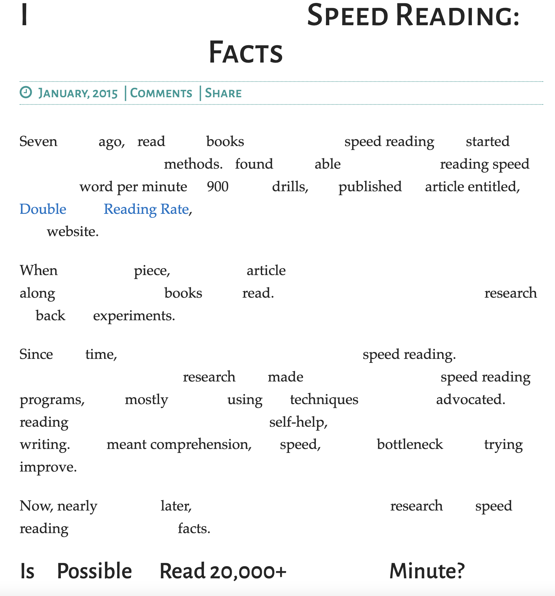

# Read! Read Faster
Hiding some unimportant words while you're reading to help you read faster.

## Run on Chrome
<ul>
<li>Download this repo or git clone https://github.com/KarlieZhao/websort 
<li>Go to chrome://extensions and turn on the develper mode.
<li>On the extension developer page, click <b>Load unpacked</b> and select the downloaded folder.
<li>You should see the icon of <i>Read! Read Faster</i> appearing on the top bar.
<li>To run the extension, open a webpage and click on the icon.
<li>Currently there are issues with handling HTML tags, so it might not work well on every website... 
  Some tested websites: <a href="https://www.scotthyoung.com/blog/2015/01/19/speed-reading-redo/">this</a>, and <a href="https://bostonreview.net/articles/122-immigrants-face-the-u-s-death-penalty-only-2-of-those-sentences-honor-international-law/">this</a>, or most of the pages on <a href="https://bostonreview.net/">Boston Review]</a>
</ul>

### TODO:
<ul>
  <li>UI: add a popup page when icon clicked.
  <li>Shoud handle HTML tags correctly.
</ul>

## [Demo Video](https://youtu.be/23-698BlDYM)
